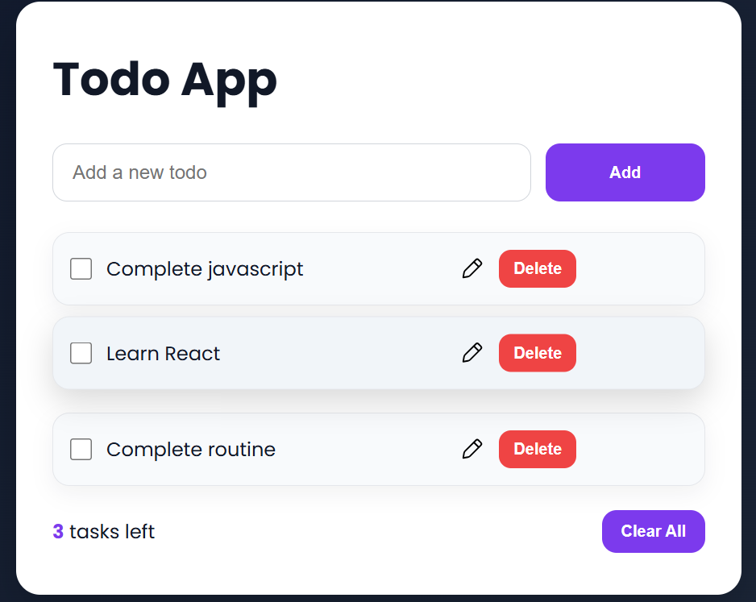

# 📝 Todo App

A clean and interactive **Todo List Application** built using **HTML, CSS, and JavaScript**.  
It helps users manage daily tasks efficiently with features like task editing, completion tracking, and persistent storage using the browser’s Local Storage.

---

## 🚀 Features

- ➕ Add new tasks  
- ✏️ Edit existing tasks  
- ✅ Mark tasks as completed  
- ❌ Delete individual tasks  
- 🧹 Clear all tasks  
- 📊 Live task counter  
- 💾 Data persistence using Local Storage  
- ⌨️ Add tasks quickly using the **Enter key**  
- 🎨 Modern and responsive UI with hover effects  

---

## 🖼️ Preview

---

## 🛠️ Tech Stack

- **HTML5** – Structure  
- **CSS3** – Styling & UI design  
- **JavaScript (Vanilla JS)** – Logic & DOM manipulation  
- **Local Storage API** – Persistent data storage  

---

## 📚 What I Learned

- DOM manipulation and event delegation  
- Handling user interactions (click, blur, key events)  
- Working with Local Storage for data persistence  
- Building interactive UI components  
- Improving UI/UX with modern CSS  

---

## ⚡ Future Improvements

- Store tasks as structured data (JSON) instead of innerHTML  
- Add task filters (All / Completed / Pending)  
- Add animations for better UX  
- Convert into a React-based application  

---

## 📄 License

This project is open-source and available under the MIT License.